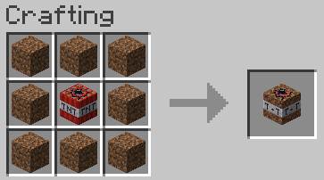

## DirTNT

A Fabric Minecraft mod that adds Dirt TNT for all your hole filling needs.
- requires Minecraft 1.16-1.17, Fabric Loader and Fabric API
- required on the server and client

Video demonstration:  

