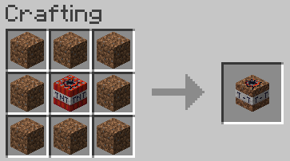

## DirTNT

A Fabric Minecraft mod that adds Dirt TNT for all your hole filling needs.
Now also comes with Sand, Gravel and Stone TNT and can be configured for literally any block in the game!

For the latter, see the `dirtnt.json` config file (that's generated when the game is started).
If you want to experiment, there's an `enableAll` debug option too.

- for Fabric Minecraft, requires Fabric API
- versions prior to 1.4 require [ARRP](https://www.curseforge.com/minecraft/mc-mods/arrp) or [BRRP](https://modrinth.com/mod/brrp) (choose one)
- version 1.4 requires [BRRP](https://modrinth.com/mod/brrp) and since version 1.5 neither is required anymore!
- required on the server and client
- server and client need to have the exact same config

### Video demonstration:

